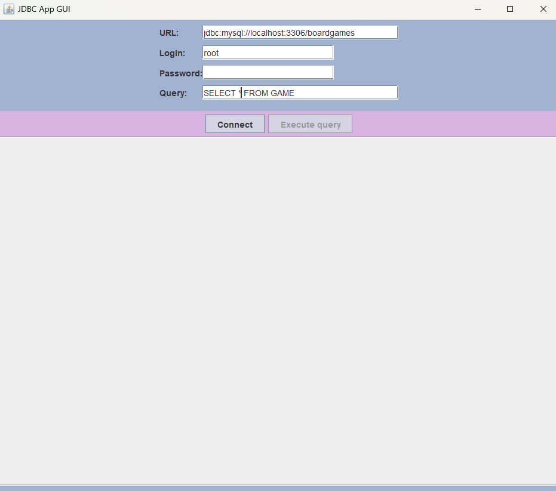
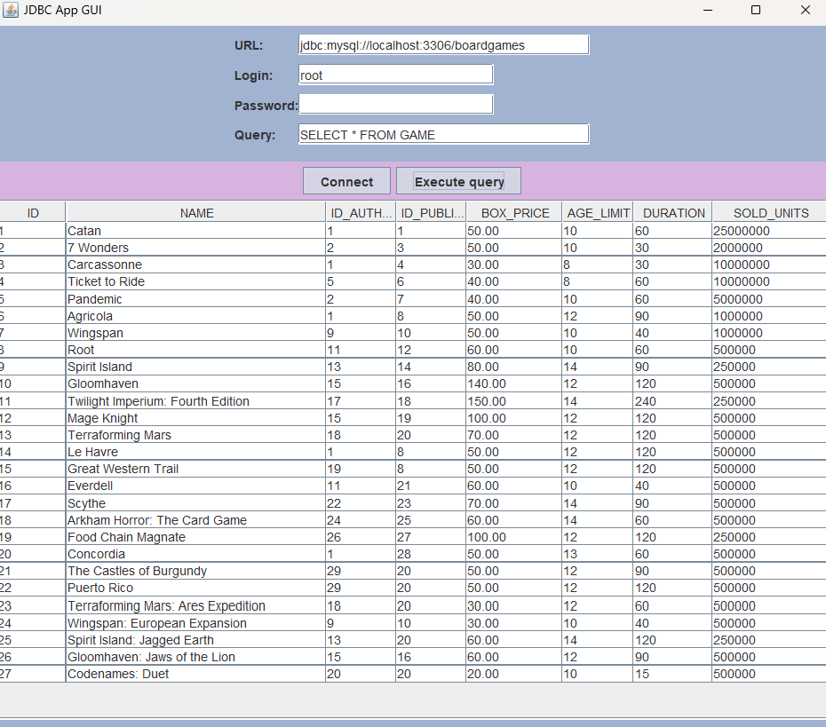
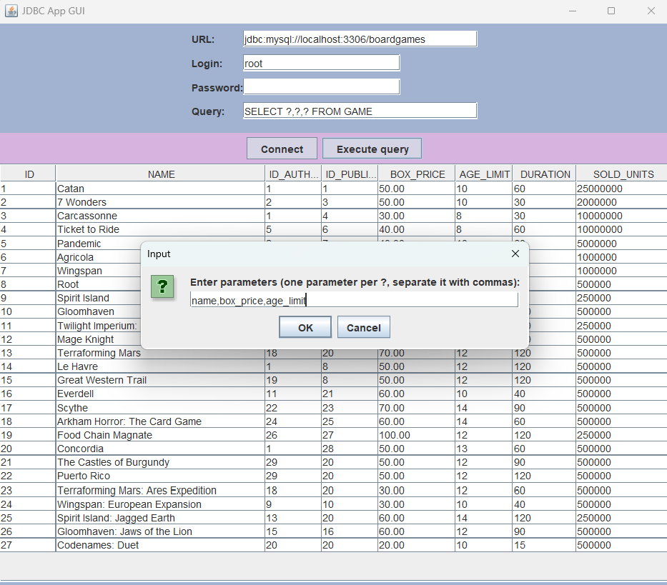

# Project Title

JDBC simpleapp

## Description
Java application using JDBC to connect to any database and provide some features such as: allowing the input of queries, displaying the results in table format. 

## Overview

* This project involves creating a interface to interact with any database.



* Once connected, one can do any query on this database



* A parameted query can also be done, with fields name do set in a wizard



## Getting Started

### Dependencies

To set up and run this Java project on your system, make sure you have [Java SE Development Kit 8 (JDK 1.8.0_381)](https://www.oracle.com/fr/java/technologies/downloads/) or a compatible version installed.

We also need an availbale Database Management System (DBMS) and connection parameters (URL, login, pwd). To develop this project, for instance, I used [Laragon](https://laragon.org/index.html), which provides MySQL and PhpMyAdmin right from the installation. An example database, example-games-base is provided with the projet with fake data to test the projet. 

   ```bash
mysql -u root example-games-base.sql
   ```

### Driver

We also need a JDBC driver suitable for the DBMS. For MySQL, it can be dowloaded from [MySQL website](https://dev.mysql.com/downloads/connector/j/). After downloading and placing the driver, you need to create an environment variable CLASSPATH that points to the received .jar file. 

### Installing

* Clone the project repository from the Git repository

   ```bash
   git clone https://github.com/paulinebrisset/JDBCApp.git
   ```

* Navigate to the cloned directory using the cd command
   ```bash
   cd JDBCApp
   ```

* Compile the Java source files using the javac command
   ```bash
   javac *.java
   ```

### Executing program

* Lauch your DBMS

* Run the application
   ```bash
   java JDBCAppGui.java
   ```
* Provide the connection information in the form
* Clic on "Connect" button
* Provide a query to be executed
* Clic on "Execute query"


## Author
- [Pauline Moncoiffé-Brisset](https://github.com/paulinebrisset)
based on a JDBCAppConsole class provided by David Grosser.